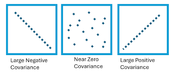
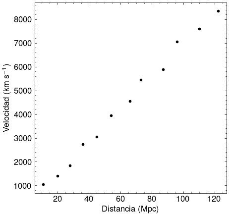
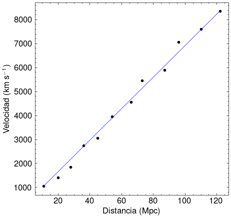

# Introducción a Análisis de Datos

## Objectives

- Review statistics (central tendency vs. dispersion) with sum notation.
- Motivate and derive fully the least squares method for linear regression.
- Study error analysis, absolute and relative error, and reporting errors.

## Estadística

Esta es el conteo mensual de erupciones solares de clase C (pequeñas erupciones frecuentes en el Sol que generalmente tienen impactos despreciables en la Tierra) observadas durante un periodo de 12 meses en dos ciclos solares diferentes.

Dataset A: Ciclo Solar X

$$ A = \{25, 27, 24, 25, 26, 23, 24, 26, 25, 24, 26, 25\} $$

Dataset B: Ciclo Solar Y

$$ B = \{35, 12, 48, 5, 20, 40, 15, 38, 10, 45, 2, 30\} $$

### 0. Preparando los datos

Antes de hacer cualquier análisis, ¿qué debemos hacer primero?

a. Ordenar los datasets

$$ A = \{23, 24, 24, 24, 25, 25, 25, 25, 26, 26, 26, 27\} $$

$$ B = \{2, 5, 10, 12, 15, 20, 30, 35, 38, 40, 45, 48\} $$

b. Contar los elementos

$$ n(A) = 12 $$

$$ n(B) = 12 $$

c. Sumar todos los elementos

$$ s(A) = 300 $$

$$ s(B) = 300 $$

### 1. Tendencia central

La primera medida que podemos realizar es la **media**:

Si tenemos $n$ elementos $x_1$, $x_2$, $x_3$, $\cdots$, $x_n$ en nuestro dataset, podemos calcular fácilmente la media $\bar{x}$

$$ \bar{x} = \dfrac{x_1 + x_2 + \cdots + x_n}{n} $$

Podemos usar una mejor notación. En lugar de escribir $x_1 + x_2 + \cdots + x_n$, podemos usar la notación de sumatoria

$$ \sum_{i=1}^{n} x_i = x_1 + x_2 + \cdots + x_n $$

Por lo tanto, nuestra media es simplemente

$$ \bar{x} = \dfrac{\sum x_i}{n} $$

Podemos calcularla fácilmente para cada dataset

$$ \bar{x}_A = \dfrac{300}{12} = 25 $$

$$ \bar{x}_B = \dfrac{300}{12} = 25 $$

Curiosamente, a pesar de ser tan diferentes, ambos datasets tienen la misma media. Ahora analizamos la mediana.

La **mediana** es el valor central en un dataset ordenado que separa la mitad inferior de la mitad superior. Si tenemos un dataset ordenado con un número impar de datos

$$ x_1,x_2,x_3,x_4,x_5 $$

¿Cuál es el término del medio? Es claramente $x_3$.

Pero si tenemos un dataset ordenado con un número par

$$ x_1,x_2,x_3,x_4,x_5,x_6 $$

No tenemos un único valor central. Tenemos dos. En ese caso, tenemos que promediarlos

$$ \text{mediana} = \dfrac{x_3 + x_4}{2} $$

En este caso, tenemos dos datasets con un número par de elementos. Sus medianas son

$$ x_{{\rm median},A} = \dfrac{25 + 25}{2} = 25 $$

$$ x_{{\rm median},B} = \dfrac{20 + 30}{2} = \dfrac{50}{2} = 25 $$

Ambos tienen la misma mediana, a pesar de ser tan diferentes.

La última medida de tendencia central es la **moda**, que es simplemente el dato que más se repite. Notamos rápidamente que es $25$ en el caso del Dataset A, pero como todos los elementos en el Dataset B aparecen solo una vez, no tiene moda.

---

Nuestro análisis de estos datasets con medidas de tendencia central no dio mucha información, obtuvimos los mismos valores para la media y la mediana.

¿Qué hacemos para entender realmente la información de estos datasets evidentemente diferentes? $\to$ **utilizamos medidas de dispersión**.

### 2. Medidas de dispersión

Primero, graficamos un **histograma** que muestre la **distribución** de los datos de cada dataset:

 

Vemos que las diferencias que observabamos a simple vista en los datasets son muy evidentes. Esta informaci\'on de c\'omo se distribuyen los datos no puede detectarse con medidas de tendencia central. Necesitamos cuantificar cómo se distribuyen estos datos.

Para esto vamos a preguntarnos ¿qué tan dispersados están los datos del centro? Una primera forma en la que podemos inicar este análisis es:

¿Qué tan lejos está cada dato de la media?

Para un elemento dado $x_i$, su desviación de la media $\bar{x}$ es simplemente:

$$ \text{Desviación} = x_i - \bar{x}$$

Si un mes tuvimos $35$ llamaradas, nuestra media es $25$, su desviación es $+10$. Si tuvimos $15$ llamaradas, su desviación es $-10$.

El siguiente paso lógico sería encontrar el promedio de todas las desviaciones para tener solo una medida de la "dispersión promedio". Sumando todas las desviaciones tendríamos

$$ \sum_{i = 1}^{n} (x_i - \bar{x}) $$

Podemos tratar con nuestro dataset $A$, recordamos que $\bar{x}_A$

$$
\begin{align*} 
\sum_{i = 1}^{n} (x_i - \bar{x}) & = (25 - 25) + (27 - 25) + (24 - 25) + (25 - 25) + (26 - 25) + (23 - 25) + (24 - 25) + (26 - 25) + (25 - 25) + (24 - 25) + (26 - 25) + (25 - 25) \\\\[10pt]
& = 0 + 2 - 1 + 0 + 1 - 2 - 1 + 1 + 0 - 1 + 1 + 0 \\\\[10pt]
& = 0
\end{align*}
$$

Este es un gran problema. Dado que la media es el "punto de balance" del dataset, las desviaciones positivas y negativas se cancelan entre sí. Para todo dataset, esta suma es exactamente cero

$$ \sum_{i = 1}^{n} (x_i - \bar{x}) = 0 $$

No podemos utilizar este valor para conseguir un promedio. Necesitamos buscar una forma de hacer que las desviaciones sean positivas de tal manera que se acumulen en lugar de cancelarlas.

Una forma sería tomar el valor absoluto, pero trabajar con valores absolutos es difícil en álgebra y cálculo. En su lugar, vamos a utilizar el **cuadrado de las desviaciones**

$$ (x_i - \bar{x})^2 \geq 0$$

Ahora podemos sumar todas las desviaciones al cuadrado y dividir para el número total de elementos $n$ para encontrar el promedio de la distancia al cuadrado. Esta medida es llamada la **varianza** ($\sigma^2$)

$$ \sigma^2 = \dfrac{\sum (x_i - \bar{x})^2}{n} $$

Es una herramienta matemática muy útil, pero tiene una limitación importante: las unidades están al cuadrado (por ejemplo, si trabajamos con una longitud en metros, $m$, las unidades de la varianza serían metros cuadrados, $m^2$, que *parecería* tratar un área).

En nuestros datasets, tenemos datos medidos en "llamaradas solares", pero nuestra varianza estaría medida en "llamaradas solares al cuadrad", una medida que no tiene sentido físico.

Para volver a las unidades originales, tomamos la raíz cuadrada de la varianza. Esta es la **desviación estándar** ($\sigma$)

$$ \sqrt{\sigma^2} = \sigma = \sqrt{\dfrac{\sum (x_i - \bar{x})^2}{n}} $$

En nuestros datasets, tenemos

$$ \sigma_A \approx 1.08 $$

Este valor es pequeño, nos dice que la desviaciones son pequeñas, por lo que los datos están muy cerca de la media. Por otro lado

$$ \sigma_B \approx 15.53 $$

Este valor nos dice que los datos, en promedio, están mucho más alejados de la media.

## Algo de álgebra

Antes de continuar, vamos a establecer algunas identidades. Primero, por definición

$$ \sum_{i=1}^n 1 = n $$

Observamos que a partir de la media, tenemos

$$ \sum x_i = n \bar{x} $$

Entonces, una forma de encontrar la suma de todos los términos es multiplicar el número de datos por el valor de la media. Nada nuevo.

Vamos al cuadrado de la desviación estándar. Tenemos

$$
\begin{align*}
\sum (x_i - \bar{x})^2 & = \sum (x_i^2 - 2x_i\bar{x} + \bar{x}^2) \\\\[10pt]
\end{align*}
$$

Recordemos una propiedad de la sumatoria. Sea $\alpha$ un número real (es decir,una constante), y sean $x_i$ e $y_i$ elementos de dos datasets. Tenemos

$$
\sum (\alpha x_i + y_i) = \alpha \sum x_i + \sum y_i
$$

Ahora recordemos que $\bar{x}$, la media, es constante para todo el dataset. Se comporta similar a $\alpha$, por lo cual puede salir de la sumatoria. Tenemos

$$
\begin{align*}
\sum (x_i - \bar{x})^2 & = \sum x_i^2 - 2\bar{x} \sum x_i + \bar{x}^2 \sum 1 \\\\[10pt]
& = \sum x_i^2 - 2\bar{x} (n\bar{x}) + n\bar{x}^2 \\\\[10pt]
& = \sum x_i^2 - 2n\bar{x}^2 + n\bar{x}^2 \\\\[10pt]
& = \sum x_i^2 - n\bar{x}^2
\end{align*}
$$

Por lo tanto, nuesta varianza se convierte en

$$
\begin{align*}
\sigma^2 &= \dfrac{1}{n}\left( \sum x_i^2 - n\bar{x}^2 \right) \\\\[10pt]
& = \dfrac{\sum x_i^2}{n} - \bar{x}^2
\end{align*}
$$

Consideremos nuevamente $x_i$ e $y_i$ elementos de dos datasets. Tenemos a partir de lo anterior,

$$
\bar{x} = \dfrac{1}{n}\sum x_i,\quad\quad \bar{y}=\dfrac{1}{n}\sum y_i
$$

Nos preguntamos ahora, ¿cuál es la relación entre estas dos variables? Una nueva medida que responde esta pregunta se llama **covarianza**

$$
\text{cov}(x,y) = \sum (x_i - \bar{x}) (y_i - \bar{y})
$$

Dependiendo del valor de esta cantidad, podemos tener

- Si $\text{cov}(x,y) > 1$, decimos que es una relación positiva.
- Si $\text{cov}(x,y) < 1$, decimos que es una relación negativa.
- Si $\text{cov}(x,y) = 0$, no existe relación (o es algo complicada).

Podemos desarrollar esta expresi\'on

$$
(x_i - \bar{x}) (y_i - \bar{y}) = x_i y_i -\bar{x}y_i - x_i\bar{y} + \bar{x}\bar{y}
$$

Aplicamos las sumas

$$
\begin{aligned}
\sum (x_i - \bar{x}) (y_i - \bar{y}) & = \sum x_i y_i - \bar{x} \sum y_i - \bar{y} \sum x_i + \bar{x}\bar{y}\sum 1 \\\\[10pt]
& = \sum x_i y_i - n\bar{x}\bar{y} - n\bar{x}\bar{y} + n\bar{x}\bar{y} \\\\[10pt]
& = \sum x_i y_u - n\bar{x}\bar{y}
\end{aligned}
$$

## Regresión lineal

Edwin Hubble descubrió que las galaxias se alejan de nosotros con una velocidad proporcional a su distancia. Podemos medir distancias a partir de métodos indirectos, como candelas estándar, mientras que las velocidades son inferidas a partir de redshift espectral.

Tenemos un dataset con dos variables:

- $x$: distancia desde la Tierra (Mpc)
- $y$: velocidad de recesión (km/s)

| Distancia (Mpc) | Velocidad (km/s) |
| :-------------: | :--------------: |
|       11        |       1050       |
|       20        |       1400       |
|       28        |       1850       |
|       36        |       2750       |
|       45        |       3050       |
|       54        |       3950       |
|       66        |       4550       |
|       73        |       5450       |
|       87        |       5900       |
|       96        |       7050       |
|       110       |       7600       |
|       122       |       8350       |

Nuestra tarea es tratar de encontrar una relación entre estas dos cantidades.

El primer paso que siempre debemos realizar con los datos para poder identificar qué tipo de relación *parecen tener* es **graficar**.

Colocamos la primera columna como la coordenada en el eje $x$, y la segunda columna como la coordenada en el eje $y$.

Parece una relación lineal. Es decir, podríamos dibujar una línea que más o menos pueda contener todos los datos o valores muy cercanos. Dibujemos una línea entre el primer y el último punto

La pregunta es ahora, ¿cómo puedo **modelar** esta relación? Es decir, ¿hay alguna forma de descubrir una ecuación que relacione la distancia y la velocidad?

Este modelo es la **ecuación de una recta**:

$$y = mx + b,$$

donde $y$ es una función de $x$, $m$ es la **pendiente** y $b$ es la **intersección con el eje y**.

Para un $x_i$ (en nuestro caso distancia) cualquiera, podríamos calcular la velocidad con $m x_i + b$. Dado que los datos no son perfectos, va a existir cierta diferencia entre la velocidad que calculamos con $mx_i + b$ y la velocidad real $y_i$.

Vamos a calcular la "desviación" entre el valor calculado y el valor real. El error o residuo $r$ para una galaxia individual está dado por

$$
r_i = y_i - (m x_i + b)
$$

es decir, calculamos la diferencia entre la velocidad real y la velocidad calculada por el modelo.

Para que nuestro modelo sea adecuado, ¿cuál debería ser el valor del error?

Debería ser cero, es decir, no debería existir diferencia entre el valor real y el valor calculado. Ahora, si calculamos el error como está ahora, vamos a tener valores positivos y negativos que podrían calcularse entre sí, **pero esto no implica que el error sea cero**.

Realizamos lo mismo que para la varianza. En lugar de la diferencia, utilizaremos la **suma del cuadrado de los residuos**:

$$
S = \sum [y_i - (mx_i + b)]^2 = \sum (y_i - mx_i - b)^2
$$

Nuestra misión es **minimizar esta suma**, es decir, obtener el mínimo valor posible. Este es el método de **Mínimos Cuadrados**.

Esto es posible usando cálculo: podemos encontrar mínimos (o máximos) obteniendo la derivada e igualandola a $0$. Por ahora, solo vamos a notar los resultados

$$
\dfrac{\partial S}{\partial m} = - 2 \sum x_i (y_i - mx_i -b) = 0
$$

$$
\dfrac{\partial S}{\partial b} = - \sum (y_i - mx_i - b)
$$

Con la primera ecuación tenemos

$$
\begin{aligned}
    \sum x_i y_i - m \sum x_i^2 - b\sum x_i = 0
\end{aligned}
$$

Y con la segunda ecuación

$$
\sum y_i - m \sum x_i - nb =  0
$$

Con esta última ecuación, resolvemos para $b$

$$
\begin{aligned}
b & = \dfrac{1}{n} (\sum y_i - m\sum x_i) \\\\
& = \dfrac{\sum y_i}{n} - m\dfrac{\sum x_i}{n} \\\\
& = \bar{y} - m\bar{x}
\end{aligned}
$$

Esto es

$$
\boxed{b = \bar{y} - m\bar{x}}
$$

Utilizamos esto en la primera ecuación

$$
\begin{aligned}
\sum x_i y_i - m \sum x_i^2 - b\sum x_i &= 0 \\\\
\sum x_i y_i - m \sum x_i^2 - (\bar{y} - m\bar{x}) \sum x_i & = 0 \\\\
\sum x_i y_i - m\sum x_i^2 - \bar{y}\sum x_i + m\bar{x}\sum x_i & = 0 \\\\
\sum x_i y_i - m\sum x_i^2 - n \bar{x}\bar{y} + m n \bar{x}^2 & = 0 \\\\
\sum x_i y_i - n\bar{x}\bar{y} - m \left(\sum x_i^2 - n\bar{x}^2 \right) & = 0\\\\
m & = \dfrac{\sum x_i y_i - n\bar{x}\bar{y}}{\sum x_i^2 - n\bar{x}^2}
\end{aligned}
$$

Tal que

$$
\boxed{m = \dfrac{\sum x_i y_i - n\bar{x}\bar{y}}{\sum x_i^2 - n\bar{x}^2}}
$$

Para nuestros datos, es útil entonces calcular estas cantidades

- $\sum x_i$ para calcular $\bar{x}$

- $\sum y_i$ para calcular $\bar{y}$

- $\sum x_i^2$

- $\sum x_i y_i$

Esto lo podemos hacer en una tabla. En nuestro caso Distancia $=x_i$ y Velocidad $=y_i$:

| $x_i$ | $y_i$ | $x_i^2$ | $x_i y_i$ |
| :---: | :---: | :-----: | :-------: |
|  11   | 1050  |   121   |   11550   |
|  20   | 1400  |   400   |   28000   |
|  28   | 1850  |   784   |   51800   |
|  36   | 2750  |  1296   |   99000   |
|  45   | 3050  |  2025   |  137250   |
|  54   | 3950  |  2916   |  213300   |
|  66   | 4550  |  4356   |  300300   |
|  73   | 5450  |  5329   |  397850   |
|  87   | 5900  |  7569   |  513300   |
|  96   | 7050  |  9216   |  676800   |
|  110  | 7600  |  12100  |  836000   |
|  122  | 8350  |  14884  |  1018700  |

Con esto es fácil calcular (con $n=12$):

- $\sum x_i = 748$, $\bar{x} = 62.33$

- $\sum y_i = 52950$, $\bar{y} = 4412.50$

- $\sum x_i^2 = 60996$

- $\sum x_i y_i = 4283850$

Ocupamos nuestras ecuaciones de mínimos cuadrados:

$$
m = \dfrac{\sum x_i y_i - n\bar{x}\bar{y}}{\sum x_i^2 - n\bar{x}^2}
$$

$$
m = 68.42
$$

$$
b = \bar{y} - m\bar{x}
$$

$$
b = 147.40
$$

Tal que tenemos

$$
y_i = 68.42 x_i + 147.40
$$

Ahora, como estamos analizando un sistema astrofísico, necesitamos identificar qué significa cada término. En algunos casos nos concentramos en $m$ (la pendiente) o $b$ (la intersección con el eje y).

Recordemos que la ley de Hubble nos indica

$$
v = H_0 d
$$

Notamos que es muy similar a la ecuación de la recta. Si $v=y_i$ se mide en km/s, y $d=x_i$ se mide en Megapársecs. Notamos que $m=68.42$ tiene dimensiones de $LT^{-1}L^{-1}$. Entonces

$$
H_0 = 68.42\,\text{km}/\text{s}/\text{Mpc}
$$

¡Hemos obtenido la constante de Hubble a partir de los datos!