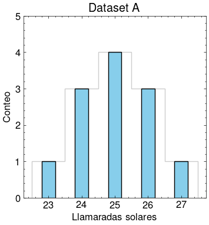
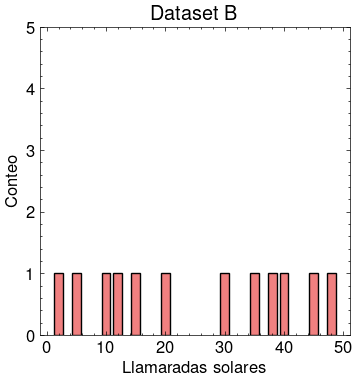

# Introducción a Análisis de Datos

## Objectives

- Review statistics (central tendency vs. dispersion) with sum notation.
- Motivate and derive fully the least squares method for linear regression.
- Study error analysis, absolute and relative error, and reporting errors.

## Estadística

Esta es el conteo mensual de erupciones solares de clase C (pequeñas erupciones frecuentes en el Sol que generalmente tienen impactos despreciables en la Tierra) observadas durante un periodo de 12 meses en dos ciclos solares diferentes.

Dataset A: Ciclo Solar X

$$ A = \{25, 27, 24, 25, 26, 23, 24, 26, 25, 24, 26, 25\} $$

Dataset B: Ciclo Solar Y

$$ B = \{35, 12, 48, 5, 20, 40, 15, 38, 10, 45, 2, 30\} $$

### 0. Preparando los datos

Antes de hacer cualquier análisis, ¿qué debemos hacer primero?

a. Ordenar los datasets

$$ A = \{23, 24, 24, 24, 25, 25, 25, 25, 26, 26, 26, 27\} $$

$$ B = \{2, 5, 10, 12, 15, 20, 30, 35, 38, 40, 45, 48\} $$

b. Contar los elementos

$$ n(A) = 12 $$

$$ n(B) = 12 $$

c. Sumar todos los elementos

$$ s(A) = 300 $$

$$ s(B) = 300 $$

### 1. Tendencia central

La primera medida que podemos realizar es la **media**:

Si tenemos $n$ elementos $x_1$, $x_2$, $x_3$, $\cdots$, $x_n$ en nuestro dataset, podemos calcular fácilmente la media $\bar{x}$

$$ \bar{x} = \dfrac{x_1 + x_2 + \cdots + x_n}{n} $$

Podemos usar una mejor notación. En lugar de escribir $x_1 + x_2 + \cdots + x_n$, podemos usar la notación de sumatoria

$$ \sum_{i=1}^{n} x_i = x_1 + x_2 + \cdots + x_n $$

Por lo tanto, nuestra media es simplemente

$$ \bar{x} = \dfrac{\sum x_i}{n} $$

Podemos calcularla fácilmente para cada dataset

$$ \bar{x}_A = \dfrac{300}{12} = 25 $$

$$ \bar{x}_B = \dfrac{300}{12} = 25 $$

Curiosamente, a pesar de ser tan diferentes, ambos datasets tienen la misma media. Ahora analizamos la mediana.

La **mediana** es el valor central en un dataset ordenado que separa la mitad inferior de la mitad superior. Si tenemos un dataset ordenado con un número impar de datos

$$ x_1,\,x_2,\,x_3,\,x_4,\,x_5 $$

¿Cuál es el término del medio? Es claramente $x_3$.

Pero si tenemos un dataset ordenado con un número par

$$ x_1,\,x_2,\,x_3,\,x_4,\,x_5,\,x_6 $$

No tenemos un único valor central. Tenemos dos. En ese caso, tenemos que promediarlos

$$ \text{mediana} = \dfrac{x_3 + x_4}{2} $$

En este caso, tenemos dos datasets con un número par de elementos. Sus medianas son

$$ x_{{\rm median},\,A} = \dfrac{25 + 25}{2} = 25 $$

$$ x_{{\rm median},\,B} = \dfrac{20 + 30}{2} = \dfrac{50}{2} = 25 $$

Ambos tienen la misma mediana, a pesar de ser tan diferentes.

La última medida de tendencia central es la **moda**, que es simplemente el dato que más se repite. Notamos rápidamente que es $25$ en el caso del Dataset A, pero como todos los elementos en el Dataset B aparecen solo una vez, no tiene moda.

---

Nuestro análisis de estos datasets con medidas de tendencia central no dio mucha información, obtuvimos los mismos valores para la media y la mediana.

¿Qué hacemos para entender realmente la información de estos datasets evidentemente diferentes? $\to$ **utilizamos medidas de dispersión**.

### 2. Medidas de dispersión

Primero, graficamos un **histograma** que muestre la **distribución** de los datos de cada dataset:

 

Vemos que las diferencias que observabamos a simple vista en los datasets son muy evidentes. Esta informaci\'on de c\'omo se distribuyen los datos no puede detectarse con medidas de tendencia central. Necesitamos cuantificar cómo se distribuyen estos datos.